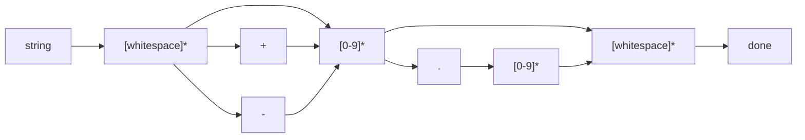

```mermaid
flowchart LR

ws1["[whitespace]*"]
ws2["[whitespace]*"]
digit1["[0-9]*"]
digit2["[0-9]*"]
plus["+"]
neg["-"]
dot["."]

string --> ws1
ws1 --> digit1
ws1 --> plus --> digit1
ws1 --> neg --> digit1

digit1 --> dot --> digit2
digit1 --> ws2

digit2 --> ws2

ws2 --> done

```
