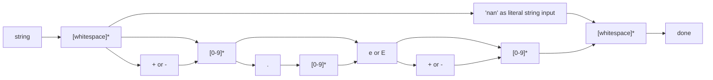

```mermaid
flowchart LR

ws1["[whitespace]*"]
ws2["[whitespace]*"]
nan["'nan' as literal string input"]
digit1["[0-9]*"]
digit2["[0-9]*"]
digit3["[0-9]*"]
pm["+ or -"]
pm2["+ or -"]
dot["."]
exp["e or E"]

string --> ws1
ws1 --> digit1
ws1 --> pm --> digit1
ws1 --> nan --> ws2

digit1 --> dot --> digit2
digit1 --> exp

digit2 --> exp

exp --> digit3
exp --> pm2 --> digit3
digit3 --> ws2

ws2 --> done

```
